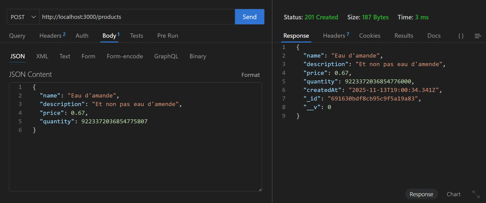
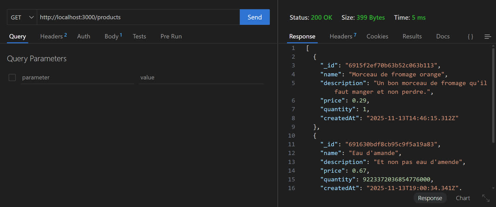
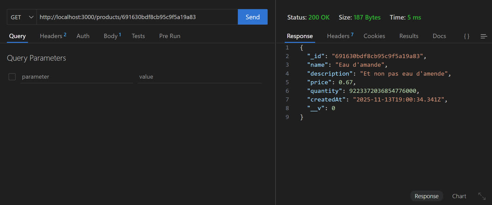
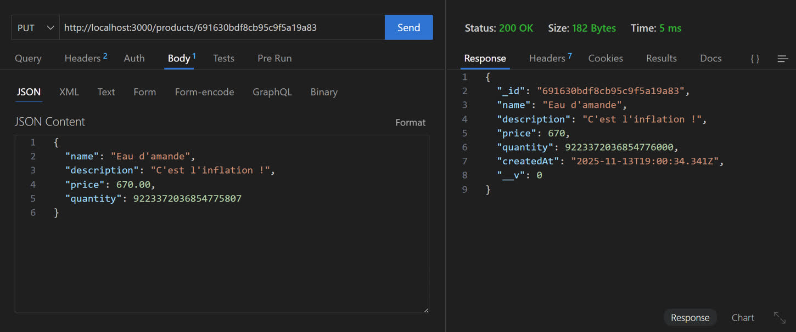
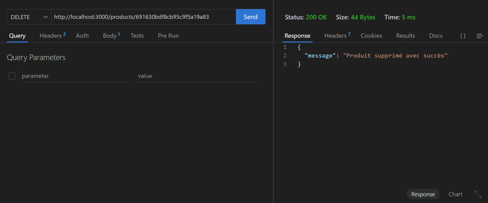

# TP API REST Node.js + Express + MongoDB

Réaliser une API REST permettant de gérer des produits en utilisant Node.js, Express, MongoDB et Mongoose.

L’objectif est de comprendre les bases d’une architecture backend moderne : modèle, contrôleur, routes et serveur.

Fonctionnalités :

- Création, affichage, mise à jour et suppression de produits (CRUD)
- Gestion d'inscription et de conenxion d'utilisateur avec token JWT
- Gestion d'un panier utilisateur

## Installation du serveur

### Packages npm

Installation des packages necéssaires au projet :

```
npm install express cors mongoose dotenv
npm install nodemon --save-dev
```

Ajout des packages pour le système de logs :

```
npm install morgan rotating-file-stream
```

### MongoDB

Création de la base de données :

```
test> use store
switched to db store
```

Création de la collection pour les produits :

```
store> db.createCollection("products")
{ ok: 1 }
```

Ajout d'une entrée pour pouvoir l'afficher plus tard :

```
store> db.products.insertOne({
...   name: "Morceau de fromage orange",
...   description: "Un bon morceau de fromage qu'il faut manger et non perdre.",
...   price: 0.29,
...   quantity: 1,
...   createdAt: "2025-11-13T14:46:15.312Z"
... })
{
  acknowledged: true,
  insertedId: ObjectId('6915f2ef70b63b52c063b113')
}
```

## Test du serveur

Création d'un produit :



Affichage de tous les produits :



Affichage d'un produit en particulier :



Mise à jour d'un produit :



Suppression d'un produit :


